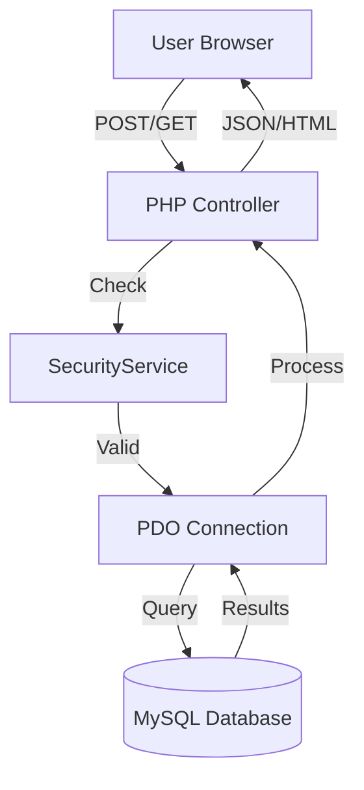

# 🛠️ DFCMS Developer Guide
## Technical Architecture, Workflow, and Security Standards

---

## 1. Directory Structure Explained

| Directory | Type | Description |
| :--- | :--- | :--- |
| `assets/` | Frontend | CSS (Modern/Glassmorphism), JavaScript, and User Uploads. |
| `config/` | Backend | DB connections, sessions, role permissions, and service configs. |
| `components/` | Reusable | Reusable PHP partials (Navbar, Sidebar, Footer, Head). |
| `auth/` | Logic | User authentication (Login, Register, Logout, Security checks). |
| `student/` | Module | Student dashboard, complaint submission, and tracking. |
| `teacher/` | Module | Teacher dashboard and lab/assignment management. |
| `admin/` | Module | System-wide oversight, workflow builder, and audit monitoring. |
| `representative/`| Module | Complaint triage and departmental forwarding. |
| `lib/` | Core | Reusable logic classes (Security, Notifications, Email, Engagement). |
| `api/` | AJAX | Backend endpoints for real-time frontend updates. |

---

## 2. Technical Architecture

### Three-Layer Model
1.  **Frontend Layer**: Modern UI using CSS Glassmorphism and ES6+ JavaScript.
2.  **Backend Layer**: PHP 8.2 logic with strictly enforced Role-Based Access Control (RBAC).
3.  **Data Layer**: MySQL with InnoDB engine, accessed via secure PDO prepared statements.

### Communication Flow

---

## 3. Core Service Components (`lib/`)

### 🛡️ `SecurityService.php`
The primary defense layer handling:
- **Rate Limiting**: Prevents brute-force on login and API endpoints.
- **Audit Logging**: Records every security event with IP and User-Agent data.
- **Encryption**: AES-256-GCM for sensitive student data.
- **Session Security**: Enforces secure flags and session regeneration.

### 🔔 `NotificationService.php`
Manages real-time alerts:
- **In-App**: Persistent notifications stored in the database.
- **Broadcast**: HOD-level system-wide announcements.
- **History**: Tracking read/unread states for audit trails.

### 📈 `EngagementService.php`
Tracks system health and user activity:
- Logs user actions for performance analytics.
- Calculates resolution efficiency metrics.

---

## 4. Authentication Lifecycle
1.  **Submission**: User submits credentials via `auth/login.php`.
2.  **Security Triage**: `SecurityService` checks for IP-based rate limits.
3.  **Validation**: Password verified via `password_verify()` against Bcrypt hashes.
4.  **Session Initiation**: `config/session.php` starts a secure, regenerated session.
5.  **Role Routing**: User is redirected to their specific module based on `$_SESSION['role']`.

---

## 5. Security Best Practices
- **CSRF Protection**: All forms must include `CSRF::input()`.
- **SQL Injection**: Never use variables in queries; always use PDO placeholders.
- **XSS Prevention**: Use `htmlspecialchars()` for all echoed user data.
- **File Uploads**: Strictly validate MIME types and move files out of the web root or into protected folders.

---

## 6. Coding Standards
- **Variable Naming**: CamelCase for classes, snake_case for variables/functions.
- **File Headers**: Every file should start with a comment describing its purpose.
- **Error Handling**: Wrap database operations in `try-catch` blocks and log via `DebugLogger`.

---
*Authored by the DFCMS Engineering Core*
