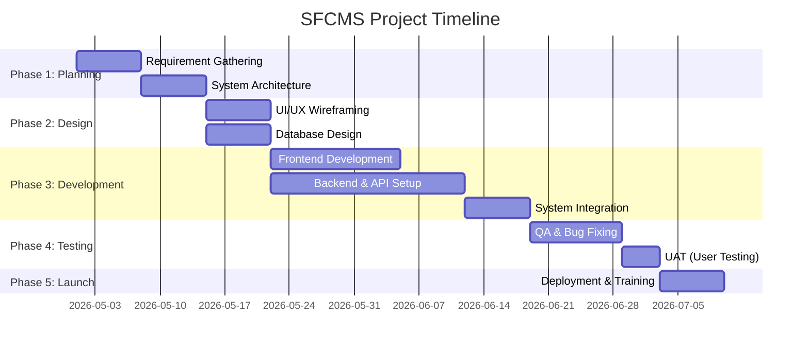

# Student Feedback and Complaint Management System (SFCMS)
**Comprehensive Project Documentation & Strategic Implementation Plan**

---

## 📑 Table of Contents
1.  [Introduction](#1-introduction)
2.  [Problem Statement](#2-problem-statement)
3.  [Objectives](#3-objectives)
4.  [Scope of the Project](#4-scope-of-the-project)
5.  [Significance of the Project](#5-significance-of-the-project)
6.  [Website Components and Detailed Inclusions](#6-website-components-and-detailed-inclusions)
7.  [Methodology](#7-methodology)
8.  [System Requirements](#8-system-requirements)
9.  [Use Case](#9-use-case)
10. [Database Design (E-R Diagram)](#10-database-design-e-r-diagram)
11. [Action Plan and Detailed Work Plan](#11-action-plan-and-detailed-work-plan)
12. [Detailed Budget Breakdown](#12-detailed-budget-breakdown)
13. [Conclusion](#13-conclusion)

---

## 1. Introduction
The **Student Feedback and Complaint Management System (SFCMS)** is a robust, web-based platform designed to bridge the communication gap between students and the educational institution's administration. It provides a centralized, secure, and highly accessible environment for students to voice their concerns, report grievances, and provide constructive feedback. By digitizing the complaint lifecycle, the system ensures transparency, accountability, and rapid resolution of issues, thereby fostering a healthier and more supportive academic ecosystem.

---

## 2. Problem Statement

> [!WARNING]
> **The Challenge of Traditional Systems**
> Educational institutions currently rely on fragmented, manual, or paper-based systems to handle student grievances.

This archaic approach leads to several critical issues:
*   **High Misplacement Rate:** Physical forms and emails are frequently lost or overlooked.
*   **Lack of Transparency:** Students have no visibility into the status or progress of their submitted complaints.
*   **Delayed Resolutions:** Bottlenecks in manual routing cause severe delays in addressing urgent student needs.
*   **Absence of Analytics:** Administration lacks actionable data to identify recurring issues, track department performance, or improve campus facilities proactively.

---

## 3. Objectives

### 3.1 General Objective
To design, develop, and deploy a comprehensive, user-friendly digital platform that streamlines the end-to-end lifecycle of receiving, routing, tracking, and resolving student feedback and complaints.

### 3.2 Specific Objectives
*   **Accessibility:** Provide a 24/7 accessible portal for students to submit grievances from any device.
*   **Transparency:** Enable real-time tracking of complaint status (e.g., *Pending, In-Progress, Resolved*).
*   **Efficiency:** Automate the routing of complaints to the appropriate administrative departments.
*   **Anonymity & Security:** Offer secure channels for sensitive complaints, ensuring student privacy and data protection.
*   **Data-Driven Insights:** Generate automated analytical reports to help management make informed administrative decisions.

---

## 4. Scope of the Project
The SFCMS is designed exclusively for the internal ecosystem of the educational institution. 
*   **Target Audience:** Enrolled Students, Faculty Members, Department Heads, and System Administrators.
*   **Functional Coverage:** Academic grievances, facility maintenance requests, administrative complaints, and general campus feedback.
*   **Platform:** A responsive web application accessible via desktop browsers, tablets, and mobile phones.
*   **Out of Scope:** The system will not handle legal arbitration or financial payment processing outside of standard administrative ticketing.

---

## 5. Significance of the Project

> [!TIP]
> **Institutional Value**
> Implementing SFCMS modernizes campus administration and directly correlates to higher student retention and satisfaction.

1.  **For Students:** Empowers them with a voice, ensuring they feel heard and valued by the institution.
2.  **For Administration:** Significantly reduces the administrative overhead of tracking papers and emails, improving staff productivity.
3.  **For the Institution:** Fosters a culture of continuous improvement, accountability, and transparency, enhancing the institution's overall reputation.

---

## 6. Website Components and Detailed Inclusions

The architecture of SFCMS is divided into distinct, secure modules tailored to specific user roles:

| Component | Detailed Inclusions |
| :--- | :--- |
| **Student Portal** | <ul><li>Secure Single Sign-On (SSO) or standard login</li><li>Interactive dashboard showing complaint history</li><li>"New Ticket" wizard (Category selection, priority, file attachments)</li><li>Real-time status tracking timeline</li></ul> |
| **Class Representative Portal** | <ul><li>Bulk feedback submission for class-wide or group issues</li><li>Meeting request scheduler with Department Heads</li><li>Announcement broadcasting tool for the class</li><li>Collective grievance escalation path</li></ul> |
| **Teacher Portal** | <ul><li>Course-specific student feedback dashboard</li><li>Direct response interface for academic inquiries</li><li>Student rating and performance analytics</li><li>Resolution history for pedagogical issues</li></ul> |
| **Lab Assistant Portal** | <ul><li>Equipment and facility maintenance reporting</li><li>Lab-specific incident logging and tracking</li><li>Inventory feedback and software request module</li><li>Hardware status monitoring dashboard</li></ul> |
| **Department Head Portal** | <ul><li>Strategic department-wide oversight dashboard</li><li>Workload assignment and ticket delegation to staff</li><li>Performance monitoring of departmental response times</li><li>Policy improvement reports based on recurring feedback trends</li></ul> |
| **Admin Dashboard** | <ul><li>Unified Kanban board for cross-departmental ticket management</li><li>Automated routing algorithms based on category and priority</li><li>Internal collaboration workspace for staff</li><li>One-click resolution triggers and system-wide settings</li></ul> |
| **Analytics & Reporting** | <ul><li>Visual Heatmaps showing complaint "hotspots"</li><li>Average Resolution Time (ART) and Efficiency metrics</li><li>Automated PDF/Excel report generation for management</li><li>Sentiment analysis of qualitative feedback</li></ul> |
| **Communication Engine** | <ul><li>Automated Email, SMS, and WhatsApp alert integration</li><li>In-app notification system with priority badges</li><li>Broadcast module for system-wide announcements</li></ul> |

---

## 7. Methodology
The project will utilize the **Agile Development Methodology (Scrum)** to ensure flexibility, continuous user feedback, and rapid delivery of functional components.

1.  **Requirement Analysis:** Stakeholder interviews and defining User Stories.
2.  **UI/UX Prototyping:** Designing wireframes and high-fidelity mockups.
3.  **Iterative Development (Sprints):** Developing the system in 2-week agile sprints.
4.  **Continuous Testing:** Automated and manual QA testing for bugs and vulnerabilities.
5.  **Deployment & Training:** Soft launch, user training, and final rollout.

---

## 8. System Requirements

### 8.1 Functional Requirements
*   Role-Based Access Control (RBAC) ensuring data isolation between students and staff.
*   Capability to upload media (images/documents) up to 5MB per complaint.
*   Automated ticket ID generation for tracking.
*   Search, filter, and pagination capabilities for large datasets.

### 8.2 Non-Functional Requirements
*   **Performance:** The system must load in under 2.5 seconds on a standard 4G connection.
*   **Security:** 
    *   **Data Encryption:** AES-256-GCM encryption for sensitive database fields.
    *   **Authentication:** Secure JWT (JSON Web Tokens) for session management and API access.
    *   **Protection:** Integrated rate-limiting (Login: 10 attempts/15 min) and security audit logging.
    *   **Infrastructure:** Secure HTTPS/TLS enforced across all communication channels.
*   **Availability:** Minimum 99.9% uptime architecture.
*   **Responsiveness:** Mobile-first UI adapting to all screen sizes.

### 8.3 Technical Security Architecture
The SFCMS implements a "Defense in Depth" strategy through the `SecurityService` layer:
*   **Audit Logging:** Every security-sensitive event (logins, unauthorized access attempts) is logged with IP, User Agent, and timestamps.
*   **Password Policy:** Strictly enforced complexity (12+ chars, uppercase, lowercase, numbers, and symbols).
*   **Rate Limiting:** Protection against Brute Force and DoS attacks at the application level.
*   **2FA Ready:** Architecture supports Time-based One-Time Passwords (TOTP).

---

## 9. Use Case
The following diagram illustrates the primary interactions between the actors and the system.

```mermaid
usecaseDiagram
    actor "Student" as S
    actor "Class Representative" as CR
    actor "Teacher" as T
    actor "Lab Assistant" as LA
    actor "Department Head" as DH
    actor "Administrator" as A

    package "SFCMS Platform" {
        usecase "Login / Authentication" as UC1
        usecase "Submit Personal Complaint" as UC2
        usecase "Submit Collective Feedback" as UC3
        usecase "Track Ticket Status" as UC4
        usecase "Respond to Academic Issues" as UC5
        usecase "Log Lab/Equipment Incident" as UC6
        usecase "Delegate & Assign Tickets" as UC7
        usecase "Generate Analytics Reports" as UC8
        usecase "Manage Users & Permissions" as UC9
        usecase "Broadcast Announcements" as UC10
    }

    S --> UC1
    S --> UC2
    S --> UC4

    CR --> UC1
    CR --> UC3
    CR --> UC10

    T --> UC1
    T --> UC5
    T --> UC4

    LA --> UC1
    LA --> UC6
    LA --> UC4

    DH --> UC1
    DH --> UC7
    DH --> UC8

    A --> UC1
    A --> UC8
    A --> UC9

    UC2 ..> UC1 : <<includes>>
    UC3 ..> UC1 : <<includes>>
```

---

## 10. Database Design (E-R Diagram)

```mermaid
erDiagram
    USER ||--o{ COMPLAINT : "submits/manages"
    USER ||--o{ COMMENT : "writes"
    USER ||--o{ NOTIFICATION : "receives"
    DEPARTMENT ||--o{ USER : "employs"
    DEPARTMENT ||--o{ COMPLAINT_CATEGORY : "owns"
    
    COMPLAINT_CATEGORY ||--o{ COMPLAINT : "classifies"
    COMPLAINT ||--o{ COMMENT : "contains"
    COMPLAINT ||--o{ ATTACHMENT : "includes"
    
    TEACHER ||--o{ COURSE : "instructs"
    COURSE ||--o{ ACADEMIC_FEEDBACK : "receives"
    
    LAB_ASSISTANT ||--o{ LAB : "manages"
    LAB ||--o{ LAB_EQUIPMENT : "contains"
    LAB_EQUIPMENT ||--o{ MAINTENANCE_LOG : "generates"

    USER {
        int id PK
        string username
        string email
        string role "Admin, Student, Teacher, etc."
        int department_id FK
    }
    COMPLAINT {
        int id PK
        int student_id FK
        int category_id FK
        string title
        text description
        string status "Pending, Resolved, etc."
        string priority "Low, Medium, High"
        datetime created_at
    }
```



---

## 11. Action Plan and Detailed Work Plan



---

## 12. Detailed Budget Breakdown

| Category | Description | Estimated Cost (USD) |
| :--- | :--- | :--- |
| **Infrastructure & Hosting** | Domain name and basic hosting (1 Year) | $35.00 |
| **Development & Design** | Collaborative volunteer work by Engineering Core | $0.00 |
| **Team Sustenance** | Sustenance and coordination resources | $120.00 |
| **Connectivity** | High-speed data bundles and infrastructure | $50.00 |
| **Miscellaneous** | Local logistics and minor resources | $45.00 |
| **TOTAL ESTIMATED INVESTMENT** | | **$250.00** |

---

## 13. Conclusion
The implementation of the **Student Feedback and Complaint Management System** is a strategic investment into institutional well-being. By transitioning from outdated manual processes to a highly automated, transparent, and secure digital platform, the institution will drastically reduce resolution times, empower its student body, and gain invaluable data insights.
