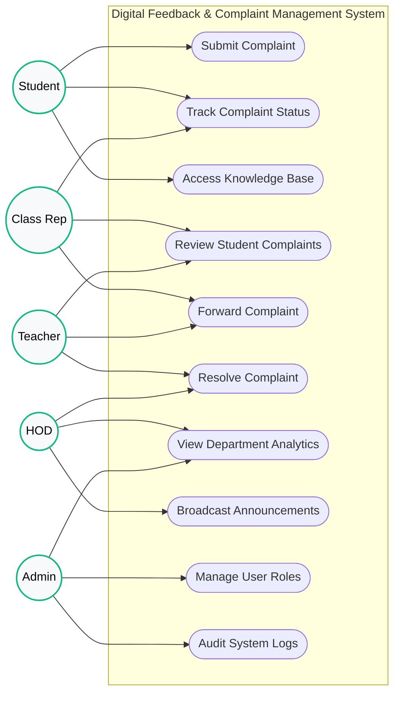
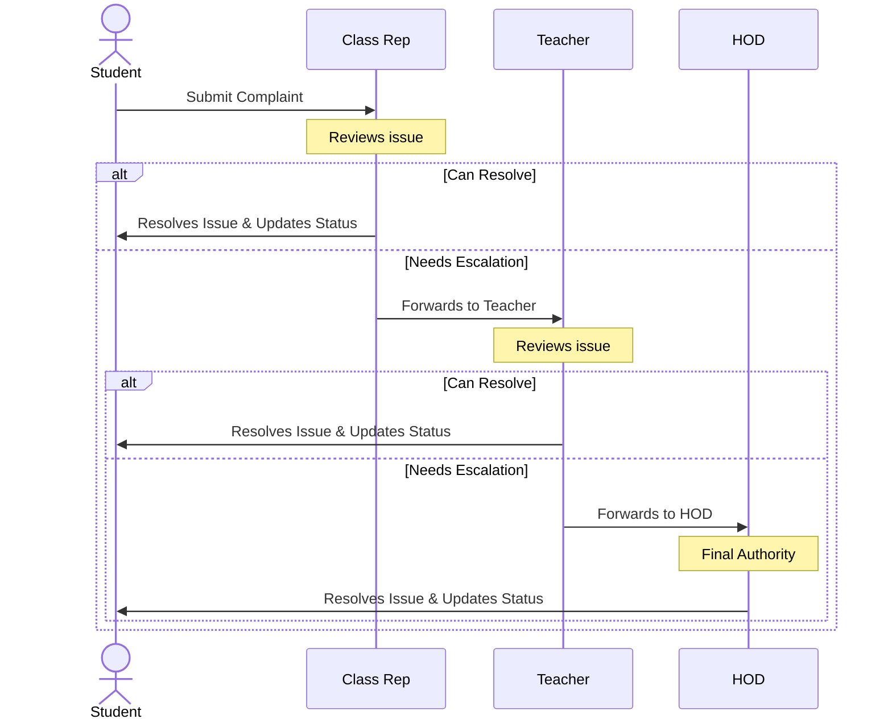

# System Analysis & Documentation

**Project Title:** Digital Feedback & Complaint Management System (DFCMS)
**Target Department:** Information Science

---

## 1. Feasibility Analysis

The feasibility study evaluates the practicality and viability of the proposed DFCMS.

### 1.1 Technical Feasibility
* **Technology Stack:** The system is built using PHP, MySQL, JavaScript, and Bootstrap 5, running on a standard web server (like Apache via XAMPP).
* **Hardware/Software:** It requires minimal server requirements. End-users only need a modern web browser and an internet/intranet connection.
* **Conclusion:** **Highly Feasible.** The technologies chosen are well-established, highly documented, and perfectly suited for building a secure, role-based management portal.

### 1.2 Economic Feasibility
* **Development Costs:** The project utilizes open-source software (PHP, MySQL, Bootstrap), completely eliminating software licensing costs. 
* **Operational Costs:** Hosting can be done on the university's existing local servers at negligible additional cost. 
* **Return on Investment (ROI):** The system will save hundreds of man-hours previously spent on manual complaint tracking, paperwork, and physical follow-ups.
* **Conclusion:** **Highly Feasible.** The cost of deployment is minimal compared to the administrative time saved.

### 1.3 Operational Feasibility
* **User Acceptance:** Students, Teachers, and the HOD are already familiar with web applications. The premium, intuitive UI ensures a very low learning curve.
* **Process Improvement:** It standardizes the chain of command (Student ➔ Class Representative ➔ Teacher ➔ HOD), preventing the HOD from being overwhelmed with minor complaints that could be solved by a CR or Teacher.
* **Conclusion:** **Highly Feasible.** The system accurately mimics and enhances the real-world administrative workflow of the university.

---

## 2. System Analysis

### 2.1 Existing System vs. Proposed System
* **Existing System:** Paper-based or unorganized verbal complaints. Complaints frequently get lost, delayed, or ignored. There is no way for a student to track if action is being taken.
* **Proposed System (DFCMS):** A centralized digital platform where complaints are logged, tracked, and routed strictly through the proper channels. 

### 2.2 Functional Requirements
1. **Role-Based Access Control:** Secure login for Admin, Student, Class Rep (CR), Teacher, Lab Assistant, and HOD.
2. **Complaint Lodging:** Students can submit complaints with categories (Academic, Facilities, etc.) and priority levels.
3. **Automated Routing & Forwarding:** CRs and Teachers can forward complaints up the hierarchy if they cannot resolve them.
4. **Status Tracking:** Real-time visual tracking (Pending, In-Progress, Resolved, Rejected).
5. **Dashboard Analytics:** Visual statistics and charts for Admins and HODs to monitor resolution rates.
6. **Knowledge Base:** FAQ section for students to resolve common issues without filing a complaint.

### 2.3 Non-Functional Requirements
1. **Security:** Passwords must be hashed. SQL injection prevention using prepared statements.
2. **Performance:** Dashboards must load in under 2 seconds.
3. **Responsiveness:** The UI must be fully accessible on both mobile phones and desktop computers.

---

## 3. Use Case Diagram

*The following diagram illustrates how different actors interact with the system's use cases.*

---

## 4. Workflow Diagram (Sequence of Escalation)

